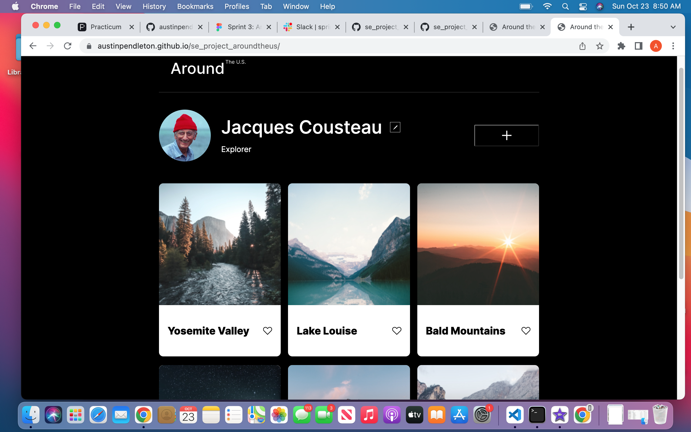
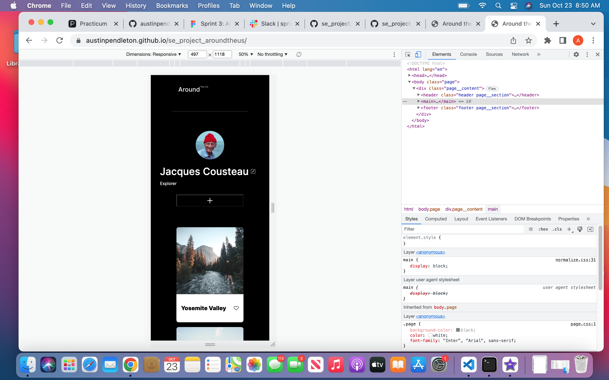

# Project 3: Around The U.S.

### Overview

- Intro
- Figma
- Images

**Intro**

This project was made by Austin Pendleton, a student with Practicum's Software Engineer Program. This project was made following a design on Figma using HTML and CSS techniques.

What made this project unique from our previous projects was we were tasked with making this page correctly display on popular screen sizes.

**Figma**

- [Link to the project on Figma](https://www.figma.com/file/ii4xxsJ0ghevUOcssTlHZv/Sprint-3%3A-Around-the-US?node-id=0%3A1)

- [Link to the project on GitHub Pages] (https://austinpendleton.github.io/se_project_aroundtheus/)

**Function**

Currently the landing page doesn't have much function besides the awesome design to display some images. But we will building off of this design in future projects to make it a more functional platform!

